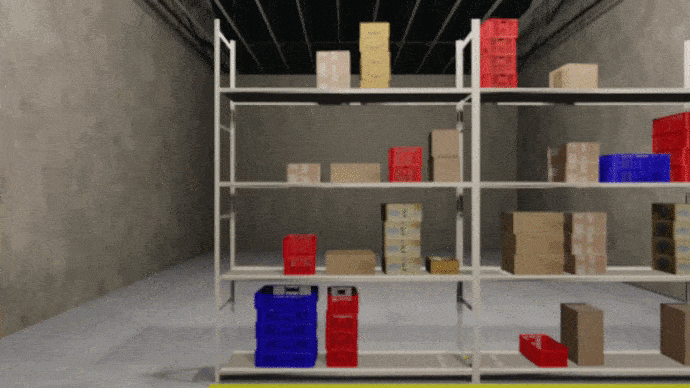

 # WareSynth

 A procedural synthetic  data  generation pipeline  that  can  be  used  to  generate  3D  warehouse  scenes and  automate  the  process  of  data  capture  and  generating corresponding  annotation.

## A sample Warehouse
<iframe width="560" height="315" src="https://www.youtube.com/embed/inYH3Hqf-Ek" title="YouTube video player" frameborder="0" allow="accelerometer; autoplay; clipboard-write; encrypted-media; gyroscope; picture-in-picture" allowfullscreen></iframe>

## The Generation of Warehouse

Our  generation  process  entails  placement  of  objects  in the scene procedurally in a randomized fashion, followed by adjustment of the lighting and textures. We perform texture editing and manipulate roughness and reflectance properties of objects to mimic real warehouse scenes.We  start  with  an  empty  warehouse.  Racks  are  placed inside the warehouse according to a randomly generated 2D occupancy map. Lighting in the warehouse is also according to the same map, where we illuminate the corridors and also introduce  ambient  lighting.  We  keep  the  inter-shelf  heightand  number  of  shelves  in  racks,  width  of  corridors  and overall  rack  density  of  the  warehouse  as  parameters  which can be tuned as per requirements. It is important to note that WareSynth is  not  constrained  by specific  settings.  The existing models can be readily substituted with custom box and rack models to configure the warehouse. We   also   randomize   the   placement   of   boxes   on   each particular  rack  by  specifying  parameters  which  control  the density of boxes placed and minimum distance between the boxes.

<!--  -->

*Note : The Code and the Assets will be Released upon Paper acceptance.