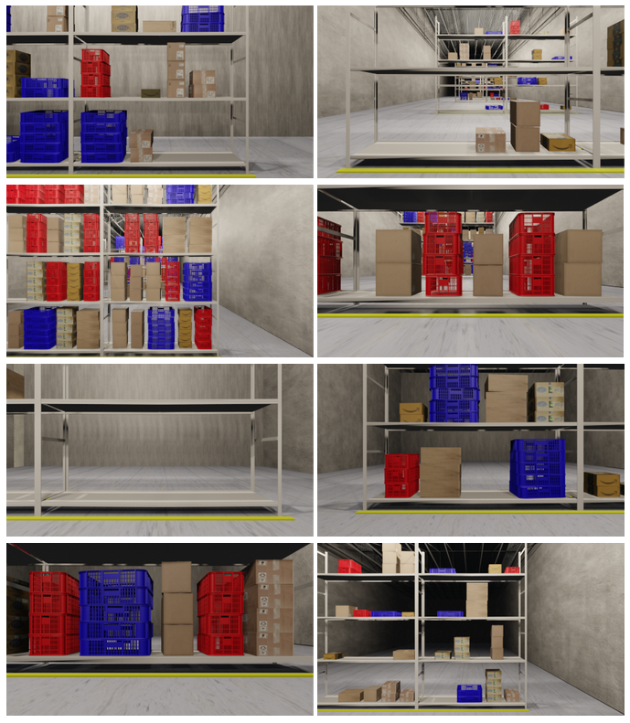
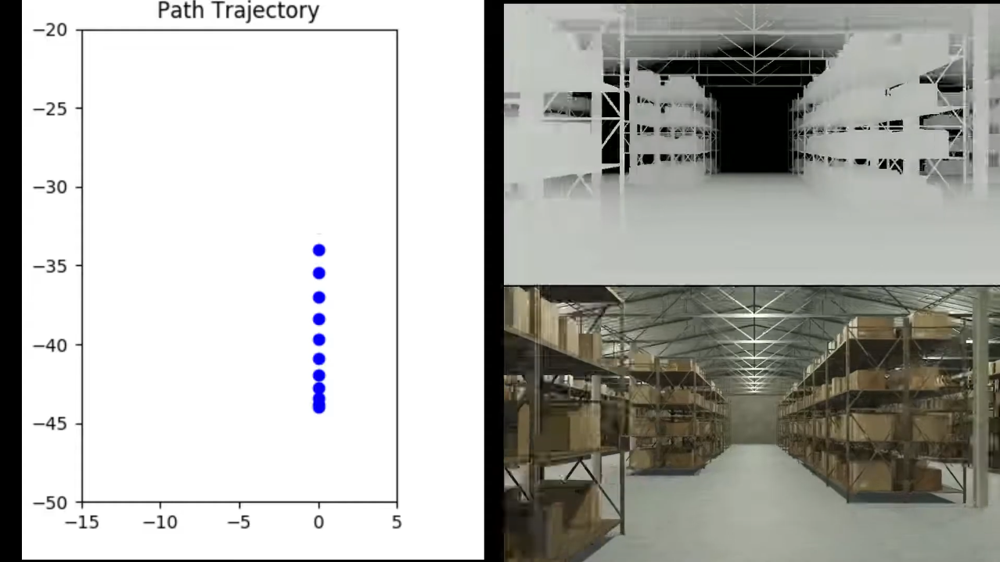
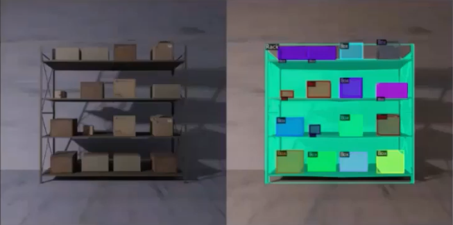
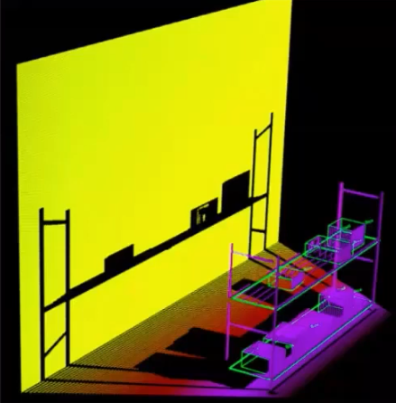

# WareSynth

 A procedural synthetic  data  generation pipeline  that  can  be  used  to  generate  3D  warehouse  scenes and  automate  the  process  of  data  capture  and  generating corresponding  annotation.

## A Sample Warehouse
<p align="center">
  
</p>

## WareSynth Synthetic Warehouse Generation Pipeline is a part of the project: "RackLay: Multi-Layer Layout Estimation for Warehouse Racks" 
### Link to [arxiv Paper](https://arxiv.org/abs/2103.09174), [RackLay](https://avinash2468.github.io/RackLay/) 
### Link to [Dataset](https://drive.google.com/drive/folders/1-GizhhfVOeyITYK0nIYpoyQPgtgALHvG?usp=sharing) generated using WareSynth (used for training RackLay network)

## Videos 

<embed width="800" height="500" src="https://www.youtube.com/embed/inYH3Hqf-Ek" title="YouTube video player" frameborder="0" allow="accelerometer; autoplay; clipboard-write; encrypted-media; gyroscope; picture-in-picture" allowfullscreen>

<embed width="800" height="500" src="https://www.youtube.com/embed/Gp8cWECqigw" title="YouTube video player" frameborder="0" allow="accelerometer; autoplay; clipboard-write; encrypted-media; gyroscope; picture-in-picture" allowfullscreen>

## Capabilities

- Capture camera positions along with the intrinsic and extrinsic parameters for each view.
- Extract 2D annotations such as 2D bounding boxes and semantic and instance segmentation masks of the objects.  
- Obtain the 3D positions, orientations and 3D bounding boxes for all objects present in the camera FOV, along with depth maps and normal information. 
- Our pipeline can also be used to obtain stereo-information. 
- The annotations can be exported in various popular formats like COCO, YOLO, Pix3D, KITTI, BOP as needed by the user.

<h3> Depth maps and camera trajectory </h3>
<p align="center">
     
</p>

<h3> 2D Instance segmentation masks
<p align="center">
     
</p>
 
<h3> 3D bounding boxes,shown on point cloud generated from RGB-D data 
<p align="center">
     
 </p>
 
 ## How to cite
If you find this work useful, please use the following BibTeX entry for citing us
```
@misc{nigam2021racklay,
      title={RackLay: Multi-Layer Layout Estimation for Warehouse Racks}, 
      author={Meher Shashwat Nigam and Avinash Prabhu and Anurag Sahu and Puru Gupta and Tanvi Karandikar and N. Sai Shankar and Ravi Kiran Sarvadevabhatla and K. Madhava Krishna},
      year={2021},
      eprint={2103.09174},
      archivePrefix={arXiv},
      primaryClass={cs.CV}
}
```

## Contact information
- anurag.sahu@research.iiit.ac.in
- tanvi.karandikar@students.iiit.ac.in
