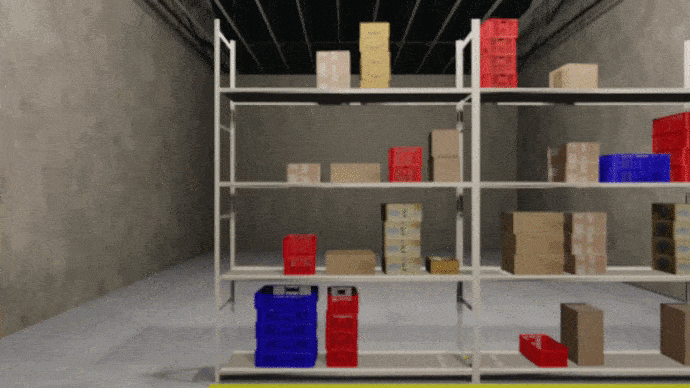

 # WareSynth

 A procedural synthetic  data  generation pipeline  that  can  be  used  to  generate  3D  warehouse  scenes and  automate  the  process  of  data  capture  and  generating corresponding  annotation.



## Setup

You need to download blender from : <a href = "https://www.blender.org/download/"> Blender Download </a> <br>
The assets files should also be downloaded from : <a href = ""> Give Drive  link </a> <br> 
The scripts here need blender to run, and you need to have the files set up as:
```bash
├── Project Directory
│   ├── Blender
│   │   ├── blender (executable)
│   ├── WareSynth (This repo)
│   │   ├── src
│   │   ├── objects (assets)
|   |   |   ├── primitives
```


## Utility
* In order to generate the warehouse along with the front and top layouts:
```
bash genrateDataset
```

* If you want to also Generate Kitti, goto Constants files and make the GENERATE_KITTI flag true and then run the script
```
gedit scripts/pillared_warehouse/Constants.py
GENERATE_KITTI = True
bash genrateDataset
```

* The number of images and other configs of the warehouse can be altered by changing variables.

